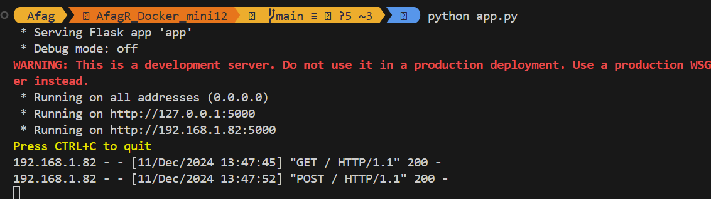
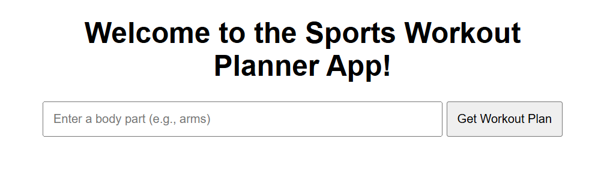
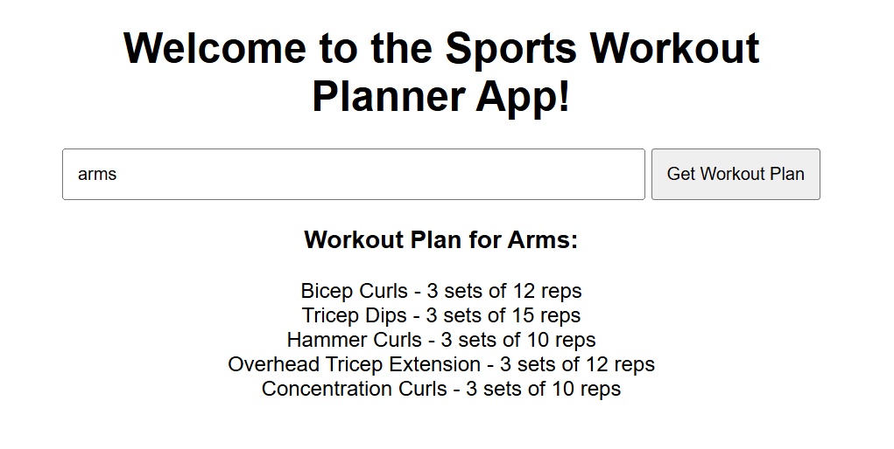
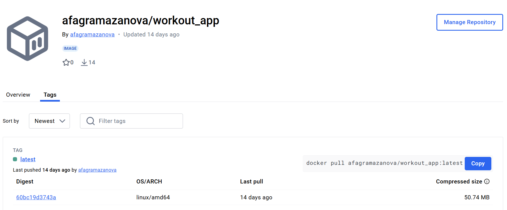
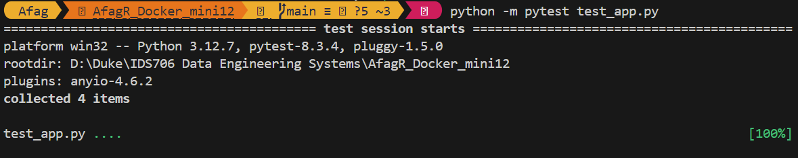

# AfagR_Docker_week12

[](https://github.com/nogibjj/AfagR_Docker_mini12/actions/workflows/CI.yml)

I developed a containerized Flask application that generates workout plan based on a database of pre-defined workout plans. 

## Local Development

1. Clone the repository:
```bash
git clone <repository-url>
cd <repository-name>
```

2. Create and activate a virtual environment (optional):
```bash
python -m venv venv
source venv/bin/activate  # On Windows: .\venv\Scripts\activate
```

3. Install dependencies:
```bash
pip install -r requirements.txt
```

4. Run the application:
```bash
python app.py
```


5. Access & use the App

- 5.1 Click the link `http://localhost:5001` to visit the application


- 5.2 Welcome Page


- 5.3 Enter the target area and see the workout plan



## Dockerhub Image

The application image is available on Docker Hub: 



## Testing

Run the tests using:
```bash
python -m pytest test_app.py
```



## Continuous Integration

The project uses GitHub Actions for CI/CD. The workflow includes:
- Running tests
- Building Docker image
- Publishing to Docker Hub
